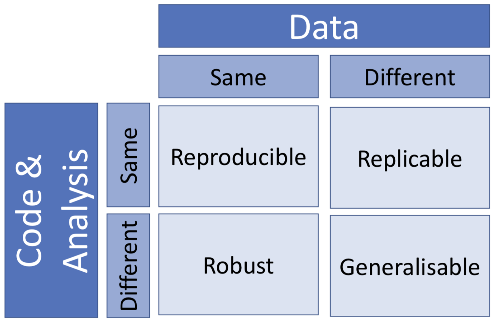

```{r setup, include=FALSE}
options(htmltools.dir.version = FALSE)
knitr::opts_chunk$set(message = FALSE, 
                      echo = FALSE, 
                      warning = FALSE,
                      fig.align = "center")
```

```{r xaringan-themer, include=FALSE, warning=FALSE}
library(xaringanthemer)
style_duo_accent(
  primary_color = "#9F999C",
  secondary_color = "#FFE5F3",
  inverse_header_color = "#8F8C8E",
  link_color = "deeppink",
  title_slide_text_color = "#3d3d3d",
  title_slide_background_image = "img/title-slide-background-light.png",
  title_slide_background_position = "left",
  header_font_google = google_font("Josefin Sans"),
  text_font_google   = google_font("Montserrat", "300", "300i"),
  code_font_google   = google_font("Fira Mono")
)
```

```{r data analysis of stories, include = FALSE}
library(tidyverse)

story_data <- read_csv("data/workflows-stories-from-the-trenches-themes.csv") |> 
 drop_na(reproducibility_theme, cost_theme)

number_of_stories <- nrow(story_data)

repro_theme_data <- story_data |> 
  select(-cost_theme) |> 
  mutate(reproducibility_theme = str_extract(reproducibility_theme, "[a-z,]+ ?[a-z,]+ ?[a-z,]+"),
         repro_theme_1 = str_extract(reproducibility_theme, "[a-z]+ ?[a-z]*"),
         repro_theme_2 = str_extract(reproducibility_theme, ",[a-z]+ ?[a-z]*"),
         repro_theme_2 = str_replace(repro_theme_2, ",", "")) |>
  pivot_longer(repro_theme_1:repro_theme_2, names_to = "col_to_drop", values_to = "repro_theme") |>
  drop_na(repro_theme) |> 
  select(-col_to_drop)

repro_theme_summary <- repro_theme_data |> 
  group_by(repro_theme) |> 
  summarise(perc = n() / number_of_stories * 100)

repro_theme_chart <- ggplot(repro_theme_summary, aes(x = perc,
                                                     y = reorder(repro_theme, perc))) +
  geom_bar(stat = "identity") +
  labs(x = "Percentage of stories reporting failure",
       y = "Reproducibility failure") +
  theme_minimal() +
  theme(text = element_text(size = 16))


cost_theme_data <- story_data |> 
  select(-reproducibility_theme) |> 
  mutate(cost_theme = str_extract(cost_theme, "[a-z,]+ ?[a-z,]+ ?[a-z,]+"),
         cost_theme_1 = str_extract(cost_theme, "[a-z]+ ?[a-z]*"),
         cost_theme_2 = str_extract(cost_theme, ",[a-z]+ ?[a-z]*"),
         cost_theme_2 = str_replace(cost_theme_2, ",", "")) |>
  select(-cost_theme) |> 
  pivot_longer(cost_theme_1:cost_theme_2, names_to = "col_to_drop", values_to = "cost_theme") |>
  drop_na(cost_theme) |> 
  select(-col_to_drop)

cost_theme_summary <- cost_theme_data |> 
  group_by(cost_theme) |> 
  summarise(perc = n() / number_of_stories * 100)

cost_theme_chart <- ggplot(cost_theme_summary, aes(x = perc,
                                                   y = reorder(cost_theme, perc))) +
  geom_bar(stat = "identity") +
  labs(x = "Percentage of stories reporting cost",
       y = "Cost of reproducibility failure") +
  theme_minimal() +
  theme(text = element_text(size = 16))
```

class: middle

## What is **reproducibility**?

### *Reproducibility* is reaching the same result given the same input, computational methods, and conditions<sup>1</sup>

.footnote[
[1] Committee on Reproducibility and Replicability in Science (2019), Reproducibility and Replicability in Science, Washington, D.C.: National Academies Press. https://doi.org/10.17226/25303
]

<br>

*Where:*

input = data
<br>computational methods = computer code
<br>conditions = computational environment

---

class: middle, center

This is distinct from **replicability**, **robust**, 
and **generalizable**.

<br>

```{r repro-in-context, out.width="50%"}

```

Source: [Joelle Pineau et al., (2020). Improving Reproducibility in Machine Learning Research](https://arxiv.org/pdf/2003.12206.pdf)
<br>[(A Report from the NeurIPS 2019 Reproducibility Program). arXiv:2003.12206](https://arxiv.org/pdf/2003.12206.pdf)

---

class: middle

## How does this fit in with a "Theory and Methods for Building Successful Data Analyses"?

Reproducible data analysis can "help" make an analysis successful by helping build "trust" in the analysis.
This trust is important for stakeholders, of whom the application of the analysis impacts.

For example, it can:

1. provide evidence that the results or product could be regenerated given the same input computational methods, and conditions

2. is transparent - a human can audit all steps taken during analysis

3. if also version controlled, there is also a complete record of how and why analysis decisions were made

---

class: middle

## How does this fit in with a "Theory and Methods for Building Successful Data Analyses"?

- Reproducible data analysis can "help" make an analysis successful by helping with efficiency of performing the analysis.

- This is less "important" from an ethical lense, but extremely important from a financial/business perspective.

- This appears to be the most obvious pain point for the data scientist and organization when reproducibility failures occur. 

---

class: middle

## Reproducibility failures as reported by Data Scientists

We asked graduate and undergraduate Data Scientists (in training) 
for real life stories of data analysis workflow challenges and failures 
they had faced in the past (either at school or on the job).

.pull-left[

From the `r number_of_stories` stories we collected, 
four main themes related to failures in reproducibility emerged:

1. version control

2. code

3. documentation

4. environments
]

.pull-right[

```{r repro_theme_chart, fig.width=7, fig.height=4, fig.retina=2}
repro_theme_chart
```

]

---

class: middle

## Impacts of reproducibility failures as reported by Data Scientists

.pull-left[
<br><br><br><br>
These 76 stories also described the impacts 
as well as the reproducibility failures,
with the most common by far being loss of time.
]

.pull-right[

```{r cost_theme_chart, fig.width=7, fig.height=4, fig.retina=2}
cost_theme_chart
```

]

---

class: middle, inverse, center

## Some representative stories...

---

class: middle

*"When I was working with my last company, my team had a large dataset stored regarding some traffic data in the database and I wrote a script to retrieve the data and do data analysis in a single jupyter notebook, without putting proper documentation nor comments. The project was then tabled for a few months. But then a summer intern came and was assigned to pick up the project, so I had to explain everything in the notebook to her but I had totally no idea what I wrote since the logic was not quite straight-forward. It was also a hard time to set the environment up in her laptop since we had a bunch of libraries and dependencies used in the notebook. We finally took a week or two to set the environment up and transfer the knowledge to the intern, which was really a waste of time."*

-- Master of Data Science student, UBC

<br>

- **Reproducibility failure > insufficient documentation** 
- **Impact of reproducibility failure > loss of time**

---

class: middle

*"In my line of work, my colleagues and I heavily relied on SQL queries to withdraw data from database. She always forgot to save the queries while just sending me an excel file to read. Sometimes (Most of the time) when I cross checked the data, the result didn't match. It usually required hours of troubleshooting to figure out where the gap was between my query and her data. ¯\_(ツ)_/¯"*

-- Master of Data Science student, UBC

<br>

- **Reproducibility failure > methods not recorded as code** 
- **Impact of reproducibility failure > loss of time**

---

class: middle

*“When I was working in my last job creating a database, I was working between two different computer systems. I had written the code on my local computer (a windows) but it was being deployed on a Linux command line system. To debug my code it was easier to do on my computer but certain lines of code were specific to the linux machine vs. the window machine. While I was using version control I had a really hard time keeping track of which script was which and it caused me to waste lots of time and energy trying to fix the issue”*

-- Master of Data Science student, UBC

<br>

- **Reproducibility failure > lack of a shippable and shareable computational environment** 
- **Impact of reproducibility failure > loss of time**

---

class: middle

## Levels that non-reproducible analysis can have an impact on 

- Data Scientist

- Organization

- Beyond (e.g., Science & Society)

---

class: middle

## Potential impacts on the Data Scientist

- Time, which means decreased productivity!

- Reputation! Embarrassment! Loss of confidence!

---

class: middle

## Potential impacts on the Organization

- Increased salary costs paid out (due to analysis taking increased time)

- Reputation! Embarrassment!

- Work that must be discarded

- Liability!

---

class: middle

## Potential impacts beyond


- Irreproducible (and thus, untrustworthy) analysis published in journals and taken as "truth"

- Retracted articles persisting in the literature from their citation previous to the retraction

- Delays in rollout of initiatives or products the analysis was used for

---

class: middle

## Two cases of analysis with reproducibility failures

1. McKinney et al. (2020a). International evaluation of an AI system for breast cancer screening. Nature. 577, 89–94 https://www.nature.com/articles/s41586-019-1799-6

2. Dabbous et al. (2021a). Safety and efficacy of favipiravir versus hydroxychloroquine in management of COVID-19: A randomised controlled trial. Scientific Reports. 11:7282 https://www.nature.com/articles/s41598-021-85227-0

---

class: middle

.pull-left[

```{r addendum-international-eval-ai, out.width="100%"}

```

- [Original article](https://www.nature.com/articles/s41586-019-1799-6)
- [Commentary](https://www.nature.com/articles/s41586-020-2766-y)
- [Reply to commentary](https://www.nature.com/articles/s41586-020-2767-x)
- [Addendum to article](https://www.nature.com/articles/s41586-020-2679-9)
]


.pull-right[

A research paper was published in January 2020 
that claimed they had created an artificial intelligence (AI) system 
that beat human experts in predicting breast cancer.

In October 2020, a matters arising commentary was published in response to the article,
which in particular described many reproducibility issues with the original paper.
The commentary also proposed recommendations to avoid such issues in the future.

In October 2020, the original authors published a reply to the commentary 
where they acknowledged some of the reproducibility issues 
and how they addressed them in an addendum also published that month, 
as well as attempted to justify why they were not able, or willing, 
to address other reproducibility issues pointed out in the commentary.

]

---

class: middle

### International evaluation of an AI system for breast cancer screening

- The reproducibility issues in this paper are not unique, and have been observed to occur in many machine learning (and other data analysis) papers <sup>1</sup>.

- A positive result from this paper and commentary is the creation of a [Machine Learning Reproducibility Checklist](https://www.cs.mcgill.ca/~jpineau/ReproducibilityChecklist.pdf) by Joelle Pineau

- The use of this checklist at NeurIPS 2019, 
a prominent machine learning conference, 
correlated with an increase in researchers including code with papers submitted 
to 74.4% (up from < 50% at NeurIPS 2018)<sup>1</sup>.

.footnote[
[1] [Pineau et al., (2020), Improving Reproducibility in Machine Learning Research (A Report from the NeurIPS 2019 Reproducibility Program) arXiv:2003.12206](https://arxiv.org/pdf/2003.12206.pdf)
]

---

class: middle

.pull-left[
```{r covid-19-retraction, out.width="100%"}

```

A research paper was published in March 2021 that claimed that a drug, Favipiravir, was a safe and effective alternative to another drug, hydroxychloroquine (a medication commonly used to prevent or treat malaria), in mild or moderate COVID-19 infected patients.

In September, 2021 the paper we retracted by the editors - in part due to reproducibility issues.
]

.pull-right[

<br>

*“After concerns were brought to the Editors’ attention after publication, the raw data underlying the study were requested. The authors provided several versions of their dataset. Post-publication peer review confirmed that none of these versions fully recapitulates the results presented in the cohort background comparisons, casting doubt on the reliability of the data. Additional concerns were raised about the randomisation procedure, as the equal distribution of male and female patients is unlikely unless sex is a parameter considered during randomisation. However, based on the clarification provided by the authors, sex was not considered during this process. The Editors therefore no longer have confidence in the results and conclusions presented.”*

<br>

- [Original article](https://www.nature.com/articles/s41598-021-85227-0)
- [Retraction notice](https://www.nature.com/articles/s41598-021-98683-5)

]

---

class: middle

### Safety and efficacy of favipiravir versus hydroxychloroquine in management of COVID-19: A randomised controlled trial

The problem doesn’t just stop once the article is retracted… Between the time the article was published and retracted, the article was cited 17 times!

```{r covid-retraction-citations}

```

---

class: middle

## Summary

- Reproducibility means reaching the same result given the same data, code, and computational environment.

- Reproducibility should be included in a theory for successful data analysis because:

  1. It contributes to a trustworthy analysis
  2. It increases the efficiency of performing the analysis

- The most commonly reported reproducibility failures are version control, code, documentation and environments. The most commonly reported cost is time.

- Non-reproducible analysis can have an impact on:

  - Data Scientist
  - Organization
  - Beyond (e.g., Science & Society)

---

class: middle

## Acknowledgements


- UBC Master of Data Science students

- UBC DSCI 310 students

- Joel Ostblom, Assitant Professor of Teaching, Dept. of Statistics, UBC

---

## References

1. Committee on Reproducibility and Replicability in Science (2019), Reproducibility and Replicability in Science, Washington, D.C.: National Academies Press. https://doi.org/10.17226/25303
2. Dabbous et al. (2021a). Safety and efficacy of favipiravir versus hydroxychloroquine in management of COVID-19: A randomised controlled trial. Scientific Reports. 11:7282 https://www.nature.com/articles/s41598-021-85227-0
3. Dabbous et al. (2021b). Retraction Note: Safety and efficacy of favipiravir versus hydroxychloroquine in management of COVID-19: A randomised controlled trial. Scientific Reports. 11:18983 https://www.nature.com/articles/s41598-021-98683-5
4. Haibe-Kains et al. (2020). Transparency and reproducibility in artificial intelligence. Nature. 586, E14–E16 https://www.nature.com/articles/s41586-020-2766-y
5. McKinney et al. (2020a). International evaluation of an AI system for breast cancer screening. Nature. 577, 89–94 https://www.nature.com/articles/s41586-019-1799-6
6. McKinney et al. (2020b). Reply to: Transparency and reproducibility in artificial intelligence. Nature. 586, E17–E18 https://www.nature.com/articles/s41586-020-2767-x
7. McKinney et al. (2020c). Addendum: International evaluation of an AI system for breast cancer screening. Nature. 586, E19 https://www.nature.com/articles/s41586-020-2679-9
8. Pineau, J. (2020). The Machine Learning Reproducibility Checklist https://www.cs.mcgill.ca/~jpineau/ReproducibilityChecklist.pdf
9. Pineau, J. et al., (2020). Improving Reproducibility in Machine Learning Research (A Report from the NeurIPS 2019 Reproducibility Program) [arXiv:2003.12206](https://arxiv.org/pdf/2003.12206.pdf)

---


class: inverse, center, middle

## Reproducibility: you can do data analysis without it, but should you?

#### talk slides: *[https://bit.ly/timbers-jsm-2022](https://bit.ly/timbers-jsm-2022)*
